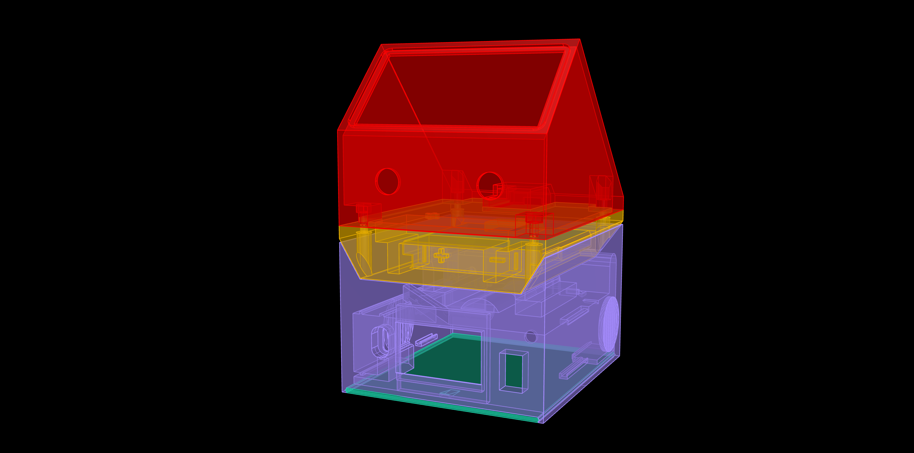
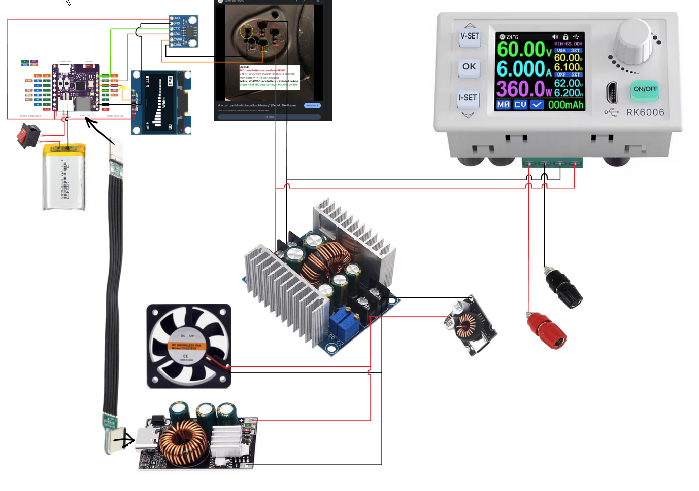

# RK6006-Bosch-battery-adapter
Enclosure and adapter for Bosch GBA and Bosch ebike batteries.

I made an enclosure for an DPS5005 Mini PSU with an adapter for Bosch-Hometools Batteries (PBA type Batteries) last year.

I added some Bosch tools which uses the Professional series Batteries (GBA type Batteries). So i decided to make an adapter for this Batteries too. Both batteries are 18 V Li-Ion Batteries. During the design work i was curious if i also can connect my 36 V Bosch eBike Battery to power a Laptop that uses PD 3.1.

I found this very usefull topic https://www.pedelecforum.de/forum/index.php?threads/use-bosch-e-bike-battery-as-power-bank.111511/ that does the basic stuff. Tricking the 36 V Bosch eBike battery.

I had to choose different powersupplys because my Laptop only charges if PD 3.1 and 3,5A is supported.

I ended up building 2 adapters. The first one is to connect a GBA 18 V Battery to the DPS5005 or in this case a RK6006. 
The second adapter connects the first adapter to a Bosch 36 V eBike Battery. 
I added a simply sketch of the wiring i used. 

## View

 
 

## Parts
3 PSU
https://de.aliexpress.com/item/1005006979920454.html
https://de.aliexpress.com/item/1005008128194606.html
https://de.aliexpress.com/item/1005005777456354.html

Display
https://de.aliexpress.com/item/1005005967766159.html

CAN Bus adapter
https://de.aliexpress.com/item/1005005334841319.html

ESP-32 C3
https://de.aliexpress.com/item/1005004866531117.html

Mini PSU
https://de.aliexpress.com/item/1005007475182107.html
or
https://de.aliexpress.com/item/1005008844138095.html

Terminals
https://www.conrad.de/de/p/sks-hirschmann-pkni-10-b-polklemme-schwarz-63-a-1-st-737934.html
https://www.conrad.de/de/p/sks-hirschmann-pkni-10-b-polklemme-rot-63-a-1-st-737947.html

USB-C Cable
https://de.aliexpress.com/item/1005007848873461.html

Crimp connectors
https://de.aliexpress.com/item/32839880068.html
https://de.aliexpress.com/item/1005002121948152.html

Switch
https://de.aliexpress.com/item/4000973563250.html

Fan (25x25x10 24V)
https://www.ebay.de/itm/126749041075

Li-Ion Battery 3,7V 2000mAh
https://de.aliexpress.com/item/32302482355.html
